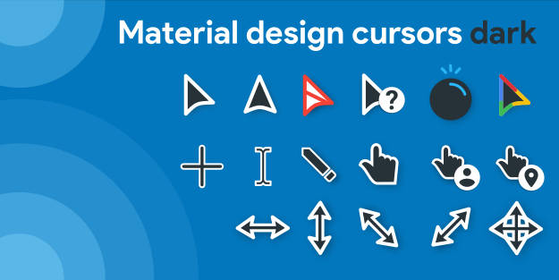

<h1 align="center">⭐ Material Design Dark Cursors ⭐</h1>

Material Design allows you to use dark cursors.
Icon Pack designed with Inkscape and RealWorld Cursor Editor.
You can use it on Windows 7/8/10/11 operating systems.

## 📌 How to Use
You can download the Cursors folder to your computer, right-click the setup.inf installation file and select install, or download the file from the releases folder and run it as administrator.

## 🕰️ Update
July 10, 2026

---

❤️ Made with Love ❤️

---
